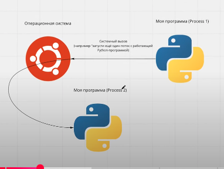
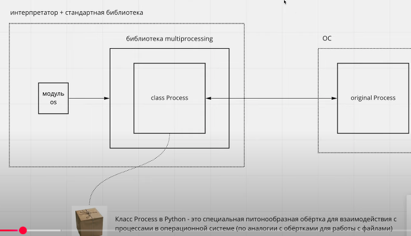
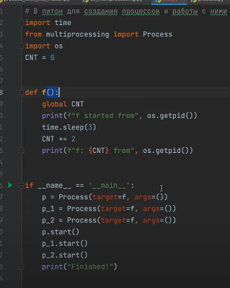
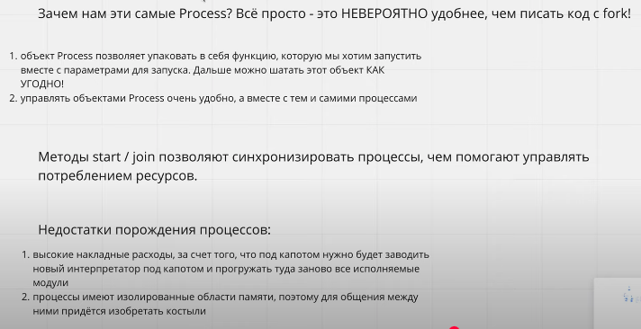

**МНОГОПРОЦЕССНОСТЬ В PYTHON**
https://www.youtube.com/watch?v=yoBj2-eSfxc&list=PLlKID9PnOE5ibKy6U7XaCA2Nqk_R1d5CJ&index=4

Многопроцессорность нужна для распараллеливания вычислительных задач.

*Системный вызов - это обращение прикладной программы к ядру ос для выполнения какой-либо операции*

Процессами управляет не питон, а ОС, но питон может попросить создать новый процесс.

*Системный вызов fork* - нужен для того, чтобы создать дочерний процесс, который будет являеться полной копией родительского (**практически**).

Для того чтобы это сделать нужно получить *id процесса os.getid()*.

Зачем нужен fork? Для того чтобы продолжить работу программы в нескольких процессах с определенной точки. Наш главный процесс при этом продолжает жить и работать отдельно от родительского. 

Если запустить fork в цикле один раз, то итоговое кол-во процессов будет составлять 2^n.

*Модуль multiprocessing*
Системный выз. fork есть не во всех ос, т.к. это может быть не безопастно (например виндовс). Не так удобно из-за ветвления

Когда объект p создался мы можем его передовать в функцию, run, terminade и тд. То есть можно взаимодействовать с интерфейсом процесса.
Можно настроить общение между процессами наприме, api, db.

*Синхронизация*
