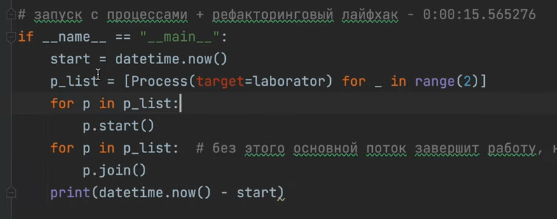

**МНОГОПРОЦЕССНОСТЬ В PYTHON**
https://www.youtube.com/watch?v=yoBj2-eSfxc&list=PLlKID9PnOE5ibKy6U7XaCA2Nqk_R1d5CJ&index=4

Многопроцессорность нужна для распараллеливания вычислительных задач.

*Системный вызов - это обращение прикладной программы к ядру ос для выполнения какой-либо операции*

Процессами управляет не питон, а ОС, но питон может попросить создать новый процесс.

*Системный вызов fork* - нужен для того, чтобы создать дочерний процесс, который будет являеться полной копией родительского (**практически**).

Для того чтобы это сделать нужно получить *id процесса os.getid()*.

Зачем нужен fork? Для того чтобы продолжить работу программы в нескольких процессах с определенной точки. Наш главный процесс при этом продолжает жить и работать отдельно от родительского. 

Если запустить fork в цикле один раз, то итоговое кол-во процессов будет составлять 2^n.

*Модуль multiprocessing*
Системный выз. fork есть не во всех ос, т.к. это может быть не безопастно (например виндовс). Не так удобно из-за ветвления

Когда объект p создался мы можем его передовать в функцию, run, terminade и тд. То есть можно взаимодействовать с интерфейсом процесса.
Можно настроить общение между процессами наприме, api, db.

*Синхронизация*
Родительский процесс может завершиться быстрее дочернего, поэтому можно использовать синхронизацию join, тогда родительский процесс будет ждать пока дочерний процесс завершиться

*Синхронизация c pool*

*Дополнительный процесс питона - это обертка (менеджер, ресурс трекер) модуля multiprocessing, который делает запрос на создания процесса с помощью системного вызова fork. 

Pool процессов - это механизм, для запуска одной и той же фукнции с разными аргументами в нескольких процессах. Он автоматически их синхронизирует. Работает для функций у которых есть аргументы. 

Зачем? 
ну как минимум тем, что меньше кода и удобнее. как максимум тем, что с помощью цикла мы указывали условно говоря запуск 3 доп процессов и потом в цикле в каждом из процессов шёл запуск функции. в пуле же можно указать Pool(2) (то есть под работу будет выделено два дополнительных процесса) и потом в функции map запустить функцию laborator ТРИ раза map(laborator, (1,2,3)) и прикол будет в том, что первый дополнительный процесс возьмёт на себя функцию laborator(1) , а второй процесс выполнит сразу ДВЕ функции laborator(2) и laborator(3); протестил у себя в ноуте эту тему

*БЛОКИРОВКА ПРОЦЕССОВ. LOCK, RLOCK*

Блокировака процессов - это механизм при котором мы блокируем рессурс для других процессов в том случае если в данный момент времени его какой то процесс использует. То есть если какой то процесс уже работает с нашем ресурсом, то для остальных процессов доступ к ресурсу на время закрыт, чтобы не перезатирать данные. Происходит это из-за сущности семафор (объект на стороне ос, который блокирует одновременный доступ к ресурсу).

Блокировка происходит тогда, когда мы хотим что то записать в файл.

Тут данные выводятся по порядку

А тут в перемешку

Почему меняеться порядок?

В первом случае один процесс блокирует ресурс пока цикл не завершиться, то есть сначала туда попадут данные 1 процесса, а данные 2 процесса ос запомнит и добавит их в файл тогда когда ресурс освободиться. При этом вывод на экран происходит параллельно, он не блокируется

Во втором случае у нас на каждой итерации разные процессы занимают ресурс и в файл добавляються то данные из 1 процесса, то данные из 2 процесса.

*Искусственная блокировка*

RLock функция дает снимать с блокировки только для того процесса, который поставил блокировку на ресурс.

*POOL ПРОЦЕССОВ И СПОСОБЫ РАБОТЫ С НИМ*

*ОБМЕН ДАННЫМИ МЕЖДУ ПРОЦЕССАМИ. QUEUE, PIPE*

Если мы добавляем 4 get то программа зависнет, т.к. главный процесс ожидает что в очередь что то еще прилетит

