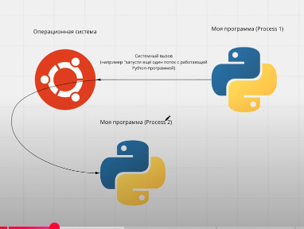

**МНОГОПРОЦЕССНОСТЬ В PYTHON (1 ЧАСТЬ)**
https://www.youtube.com/watch?v=yoBj2-eSfxc&list=PLlKID9PnOE5ibKy6U7XaCA2Nqk_R1d5CJ&index=4

Многопроцессорность нужна для распараллеливания вычислительных задач.

*Системный вызов - это обращение прикладной программы к ядру ос для выполнения какой-либо операции*

Процессами управляет не питон, а ОС, но питон может попросить создать новый процесс.

*Системный вызов fork* - нужен для того, чтобы создать дочерний процесс, который будет являеться полной копией родительского (**практически**).

Для того чтобы это сделать нужно получить *id процесса os.getid()*. Далее 